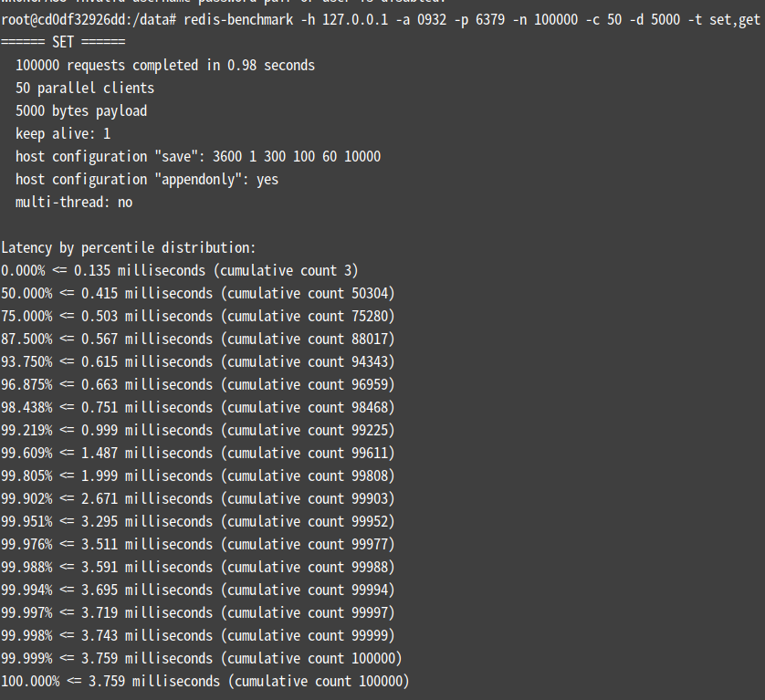
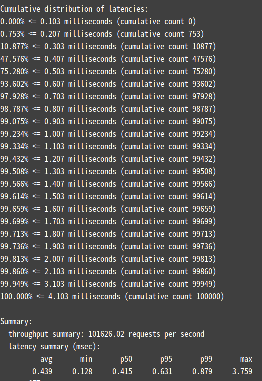
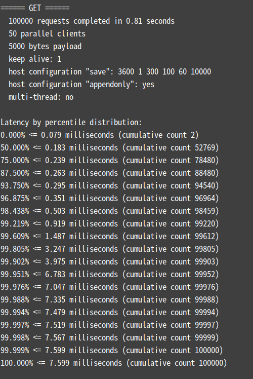
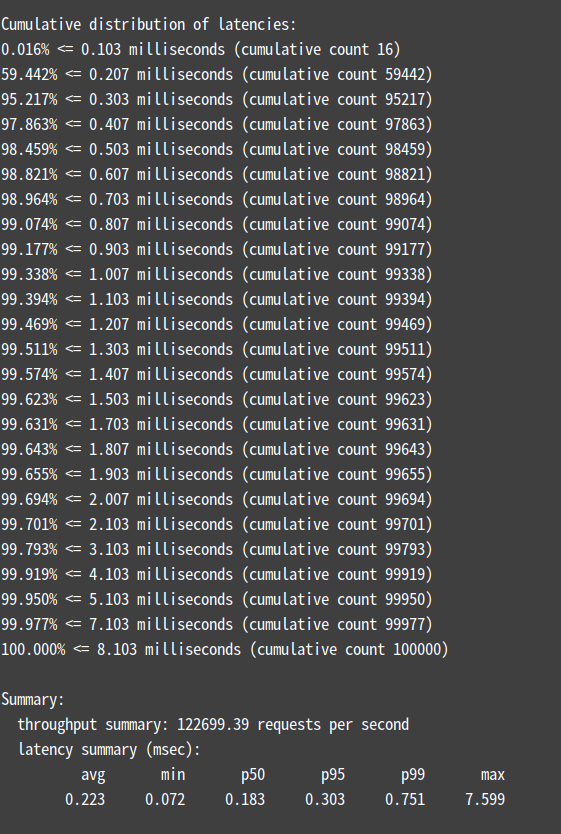

# 第八周作业
## 作业一
> 1. 使用 redis benchmark 工具, 测试 10 20 50 100 200 1k 5k 字节 value 大小，redis get set 性能。

在使用 docker部署 Redis 时，可先进入容器内再执行压测命令，具体命令集如下：
```shell
# 进入容器
$ docker exec -it redis /bin/bash

# 10w请求(-n) 50并发(-c) 测试 10 字节(-d) set,get 性能 ，-a 是密码，可选项
$ redis-benchmark -h 127.0.0.1 -a 1234 -p 6379 -n 100000 -c 50 -d 10 -t set,get -P 16 -q
SET: 709219.88 requests per second, p50=0.895 msec        
GET: 1538461.62 requests per second, p50=0.415 msec

# 20 字节 压测 
$ redis-benchmark -h 127.0.0.1 -a 1234 -p 6379 -n 100000 -c 50 -d 20 -t set,get -P 16 -q
SET: 662251.69 requests per second, p50=0.919 msec        
GET: 1538461.62 requests per second, p50=0.415 msec

# 50 字节 压测
$ redis-benchmark -h 127.0.0.1 -a 1234 -p 6379 -n 100000 -c 50 -d 50 -t set,get -P 16 -q
SET: 757575.75 requests per second, p50=0.943 msec         
GET: 1587301.50 requests per second, p50=0.431 msec

# 100 字节 压测
$ redis-benchmark -h 127.0.0.1 -a 1234 -p 6379 -n 100000 -c 50 -d 100 -t set,get -P 16 -q
SET: 729927.06 requests per second, p50=0.991 msec        
GET: 1515151.50 requests per second, p50=0.439 msec

# 200 字节 压测
$ redis-benchmark -h 127.0.0.1 -a 0932 -p 6379 -n 100000 -c 50 -d 200 -t set,get -P 16 -q
SET: 617283.94 requests per second, p50=1.063 msec         
GET: 980392.19 requests per second, p50=0.551 msec 
                   
# 1k 字节 压测
$ redis-benchmark -h 127.0.0.1 -a 1234 -p 6379 -n 100000 -c 50 -d 1000 -t set,get -P 16 -q
SET: 328947.38 requests per second, p50=1.055 msec                    
GET: 877193.00 requests per second, p50=0.711 msec

# 5k 字节 压测 ，通过 -P 引入 pipelining，可以在一定程度上提高吞吐量
$ redis-benchmark -h 127.0.0.1 -a 1234 -p 6379 -n 100000 -c 50 -d 5000 -t set,get -P 16 -q
SET: 120048.02 requests per second, p50=1.551 msec                    
GET: 324675.31 requests per second, p50=1.535 msec

# 5k 字节 压测 与使用 pipelining 的作对比
$ redis-benchmark -h 127.0.0.1 -a 0932 -p 6379 -n 100000 -c 50 -d 5000 -t set,get -q
SET: 98716.68 requests per second, p50=0.407 msec                     
GET: 116279.07 requests per second, p50=0.183 msec 
```
其中，不使用 `-q` 后，可查看压测的明细，这里以 5k 字节 的压测为例：





`redis-benchmark --help` 可查看具体的命令使用方式。通过上述压测可见随着字节数变大，Redis get/set 的吞吐量等是在逐渐降低的。

## 作业二

> 2. 写入一定量的 kv 数据, 根据数据大小 1w-50w 自己评估, 结合写入前后的 info memory 信息 , 分析上述不同 value 大小下，平均每个 key 的占用内存空间。

- key暂时为字符串 1、2、3等
- value以拼接"a"构造1中的value大小，，测试以下数量大小的数据
  - 1w
  - 2.5w
  - 7.5w
  - 10w
  - 25w
  - 35w
  - 50w 
- 每测试完一轮，将结果打印到[【geekGoWork/docs/week08/q2】](./../../docs/week08/q2) 中，明明规则为value大小+"result_"+测试数据大小+".log"，如：10字节大小的value值在1w大小的数据中的结果的对应文件为【10result_10000.log】
  - type1 中是 value大小固定，key大小固定时 导出结果
  - type2 中是 value大小固定，key大小可变时 导出结果
- 每个文件中的 【before】 部分为数据插入前的 Redis  memory模块的详情，【after】部分为数据插入后的详情
- 经过比较后，暂时以 used_memory_dataset 字段的数据作为标准计算
 
经过下面两种方式对比后
- 随着数据增多，key占用内存在一定程度上会变大
- key/value 越大，set/get 消耗时长整体越大，到达一定程度可能在成网络阻塞等情况
### value大小固定，key大小固定时
如 当key的大小固定时（如类似 00201cdc-811a-49f2-954f-b086c2eabe40 的 uuid ），针对value大小为10字节的数据从1w到50w时key的平均大小范围是 45.99936 ~  45.999968 kb，省略2位小数后为 46.00 

| value 大小 | key 平均大小范围              | key的平均大小 |
|----------|-------------------------|----------|
| 10字节     | 45.99936 ~  45.999968   | 46.00    |
| 20字节     | 43.99936 ~ 43.999968    | 44.00    |
| 50字节     | 45.99936 ~ 45.99936     | 46.00    | 
| 100字节    | 51.99936 ~  51.999968   | 52.00    |
| 200字节    | 63.99936 ~  63.999968   | 64.00    |
| 1k字节     | 63.99936 ~  64.00009    | 64.00    | 
| 5k字节     | 159.99936 ~  159.999954 | 160.00   | 

### value大小固定，key大小可变时 
| value 大小 | key 平均大小范围              | key的平均大小 |
|----------|-------------------------|----------|
| 10字节     | 13.99940 ~ 13.999968    | 14.00    |
| 20字节     | 11.99936 ~ 11.999968    | 12.00    |
| 50字节     | 13.99936 ~ 13.999968    | 14.00    | 
| 100字节    | 19.99936 ~ 19.999954    | 20.00    |
| 200字节    | 31.99936 ~ 31.99996     | 32.00    |
| 1k字节     | 31.99936 ~ 31.999968    | 32.00    | 
| 5k字节     | 127.83744 ~  127.999968 | 128.00   | 

 一轮value大小为 10字节的 计算实例
```shell
# 1w 之前是 13.9936，之后再次运行时1w的数据出现如下情况,主要是 数据插入前 used_memory_dataset 的大小变动所致 
(288384-68896-10*10000)/1000 = 11.9488
# 2.5w
(648384-48400-10*25000)/25000 = 13.9994
# 7.5w
(1848384-48400-10*75000)/75000 =13.9998
# 10w
(2448560-48576-10*100000)/10000 = 13.9998
# 25w
(6048712-48728-10*250000)/25000 = 13.9999
# 35w 13.999954285714285
(8448864-48880-10*350000)/35000 = 14.0000
# 50w  13.999968
(12049016-49032-10*500000)/50000 = 14.0000
```

## 附录
通过`redis-cli -h 127.0.0.1 -p 6379 -a 1234`登录，手动执行 `info memory`得到的 memory模块部分字段详解
```shell
# Memory
used_memory:895008  # 由 Redis 分配器分配的内存总量，包含了redis进程内部的开销和数据占用的内存，以字节（byte）为单位，即当前redis使用内存大小。
used_memory_human:874.03K  # 已更直观的单位展示分配的内存总量。
## 向操作系统申请的内存大小，与 top 、 ps等命令的输出一致，即redis使用的物理内存大小。
used_memory_rss:8892416
used_memory_rss_human:8.48M 
## redis使用的峰值内存
used_memory_peak:735381976 #redis的内存消耗峰值(以字节为单位)，即历史使用记录中redis使用内存峰值。
used_memory_peak_human:701.31M
used_memory_peak_perc:0.12% # 使用内存达到峰值内存的百分比，used_memory/ used_memory_peak) *100%，即当前redis使用内存/历史使用记录中redis使用内存峰值*100%
used_memory_overhead:830672 # Redis为了维护数据集的内部机制所需的内存开销，包括所有客户端输出缓冲区、查询缓冲区、AOF重写缓冲区和主从复制的backlog。
used_memory_startup:810072 # Redis服务器启动时消耗的内存
## 数据实际占用的内存
used_memory_dataset:64336 # 数据实际占用的内存大小，即used_memory-used_memory_overhead
used_memory_dataset_perc:75.75% # 数据占用的内存大小的百分比，100%*(used_memory_dataset/(used_memory-used_memory_startup))
allocator_allocated:1208248
allocator_active:1589248
allocator_resident:6606848
## 整个系统内存
total_system_memory:16479883264
total_system_memory_human:15.35G 
## Lua脚本存储占用的内存
used_memory_lua:37888
used_memory_lua_human:37.00K
used_memory_scripts:0
used_memory_scripts_human:0B
number_of_cached_scripts:0
## Redis实例的最大内存配置
maxmemory:0
maxmemory_human:0B
maxmemory_policy:noeviction # 当达到maxmemory时的淘汰策略
allocator_frag_ratio:1.32
allocator_frag_bytes:381000
allocator_rss_ratio:4.16
allocator_rss_bytes:5017600
rss_overhead_ratio:1.35
rss_overhead_bytes:2285568
mem_fragmentation_ratio:10.61
mem_fragmentation_bytes:8054288
mem_not_counted_for_evict:92
mem_replication_backlog:0
mem_clients_slaves:0
mem_clients_normal:20504
mem_aof_buffer:96
mem_allocator:jemalloc-5.1.0
active_defrag_running:0
lazyfree_pending_objects:0
lazyfreed_objects:0 
```
[redis info之memory模块详解](https://cloud.tencent.com/developer/article/1562172)